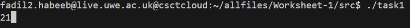
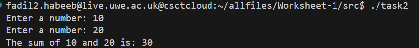
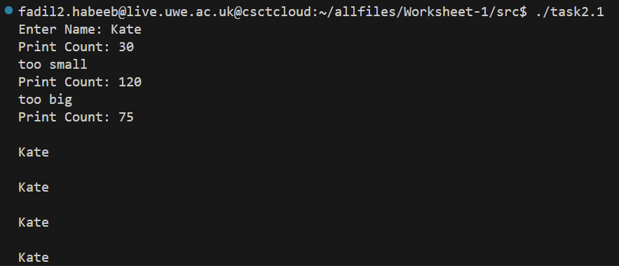
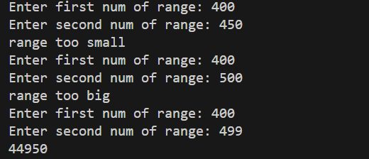

# Operating Systems Repo


## Description
Files for Operating Systems Assessment Worksheet 1.

Student ID: 22066955
## Task 1
Task 1:

Starting off by declaring variables integer1 and integer2
```assembly
segment .data
    integer1    dd  15 ;first int
    integer2    dd  6  ;second int
```
To get the sum we put integer1's value in the eax,

add the value of integer2 to eax, and store

eax's value in the result variable

```assembly
    mov eax,[integer1]  ;eax = int1
    add eax,[integer2]  ;eax = eax + int2
    mov [result], eax   ;result = int1 + int2
```
To print out our answer we call the following function:
```assembly
    call print_int      ;prints "result"
```

Create an object from "task1.asm" and merge it with driver.o and asm_io.o
to create the executable "task1".

"task1" prints 21 when ran



## Task 1 - Task 2


## Task 2.1
Program asks for a name and a print count.
If the print count is in the correct range, the program
proceeds to print the input name [printcount] times



(Prints 75 "Kate"s)
- To input a string into assembly, I used a loop to consecutively input chars until it encounters a newline (ASCII code: 10). Once the program encounters newline, it ends the loop and jumps to a different part of the code.

    ```assembly
        loopfirst:
            call read_char;
            cmp eax, 10
            je endloop
            mov [name1 + (ebx * 4 + 4)],eax
            add ebx, 1
            loop loopfirst
    ```

- Checking the validity of the print count
    ```assembly
        mov ecx, [printcount]
            ; Check if printcount is less than 100 and greater than 50
            cmp ecx,50
            JL small
            cmp ecx, 100
    ```
    - If the print count is not valid, print a message to the user and ask for a new [printcount] input

    ```assembly
    small:
        mov eax, errmessagesmall
        call print_string
        call print_nl
        jmp reinput
    big:
        mov eax, errmessagebig
        call print_string
        call print_nl
        jmp reinput
    ```
- To print out the names, we need 2 loops
    ```assembly
    loopstart:
        mov ebx, ecx
        mov ecx, [index]
        mov edx, 0
        loopname:
            mov eax,[name1 + (edx * 4)]
            call print_char
            add edx, 1
            loop loopname
        mov ecx, ebx
        call print_nl
        loop loopstart
    ```
    - First we set the value of ecx (the register used for loops in assembly) to the value of printcount, we then store the value of ecx in another register ebx. This is because we are going to change the value of ecx to perform the inner loop, once the inner loop is complete, we then give ecx back its original value such that the outer loop can function as intended
    - The purpose of the inner loop is to go through the array and print out the name, character by character.
    - The purpose of the outer loop is to run the inner loop [print count] amount of times

## Task 2.2
For task 2.2, we start by creating an array of 100 spaces filled with zeros.


```assembly
    segment .data
        arr      times 100 dd 0; array of 100 0s
```


To fill the array with numbers 1 to 100, I created a loop to go to each index of the array, then I added a the value from eax to that index. Eax is incremented at the start of each loop to fill the array with 1,2,3... all the way to 100.

```assembly
    loop_start:
        add eax, 1
        mov [arr + (eax * 4 - 4)], eax     ;index array here and give it value of eax
        loop loop_start
```


Finally to print out the sum of all the values in the array, I created a second loop that goes to each index of the array and adds it to eax, which starts at 0. Then we print out eax after the second loop finishes

```assembly
    loop_2:
        add eax, [arr + (ecx * 4)]
        loop loop_2
        add eax,[arr]
        call print_int
```

## Task 2.3
Task 2.3 was Task 2.2 but the user has to input a range to fill the array up with, instead of 1 to 100.

Code to input ranges from the user:

```assembly
    reinput:
        mov eax, msg1
        call print_string
        call read_int
        mov [rangeA], eax

        mov eax, msg2
        call print_string
        call read_int
        mov [rangeB], eax
```

Once this is complete, we add 99 to the smaller number and compare it with the larger number.

If they are equal, the range is correct and the code moves on to a different section called valid range.

```assembly
    mov ebx, [rangeA]
    mov esi, [rangeB]
    mov ecx, 99
        loop_2:
            add ebx, 1
            loop loop_2
            cmp ebx, esi
            JE validrange
```
If they arent equal, we print the user a valid message and ask for a re-input


Example:





## Make File

When making the assembly files into object files, code is pasted into the terminal.

To expedite this process, a make file is used.

Each task has the terminal code written in the make file, for example **Task 1**'s make file part has the code to create the assembly object file, and the **C** ```driver.c``` file.

```make
task1: task1.asm
	nasm -f elf task1.asm -o task1.o
	gcc -m32 driver.o task1.o asm_io.o -o task1
```

To automatically create all the ```assembly``` objects, the make file has a feature that makes all the objects.
```bash
make all
```

The code in the make file is
```make
all: task1 task2 task2.1 task2.2 task2.3
```