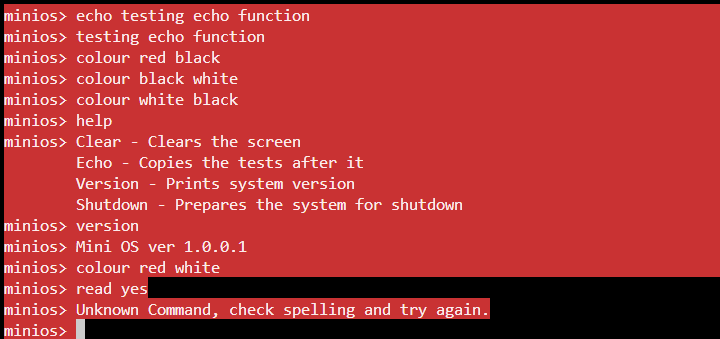

# Worksheet 2

Student ID: 22066955

## Description

This is the readme file for Operating Systems Worksheet 2 parts 1 and 2.

It goes through the processes of each task in the worksheets.

# Worksheet 2 Part 1

# Task 1

This task walked us through the first steps of making our basic operating system. The first step was to create the directory of our OS, then adding the neccessary files needed for the OS to run. The goal for Task 1 is to get ```EAX``` to be set to the value **OxCAFEBABE**. This can be achieved by using assembly code to set ```EAX``` to **OxCAFEBABE**.

**Explain that we use grub**

```assembly
mov eax, 0xCAFEBABE
```

Once this is done, the assembly code needs to be converted into an object file. This can be achieved with the code below.
```bash
nasm -f elf loader.asm
```
The next step is to create a linker file called ```link.ld```. Once the file has been created, the **Kernel** is created using the assembly object ```loader.o``` that has just been created. The below creates the **Kernel** file ```kernel.elf```.

```bash
ld -T ./source/link.ld -melf_i386 loader.o -o kernel.elf
```

The next file needed to run the OS is a file called ```stage2_eltoriot```, which is to be stored atg iso/boot/grub.

Then a ```menu.lst``` file is created to tell **GRUB** where our **Kernel** is located.

Using all these files, an **ISO IMAGE** of the OS can be created using the following:

```bash
genisoimage -R \
-b boot/grub/stage2_eltorito \
-no-emul-boot \
-boot-load-size 4 \
-A os \
-input-charset utf8 \
-quiet \
-boot-info-table \
-o os.iso \
iso
```

Once all the files have been created and stored in the right place, the following code can be entered in the terminal to run the OS.

```bash
qemu-system-i386 -nographic -boot d -cdrom os.iso -m 32 -d cpu -
D logQ.txt
```

When done correctly, ```EAX``` can be found being set to **CAFEBABE**.

```txt
EAX=cafebabe
```

# Task 2

The next task was to extend the **kernel** such that it can call C functions, then to implement example functions to test the functions.

To connect the **kernel** to a **C** file, the ```loader.asm``` file used to create the **kernel** can be connected to a **C** object. To do that, create a **C** file and compile it using GCC to create a **C** object

GCC:
```bash
gcc -m32 -nostdlib -nostdinc -fno-builtin -fno-stack-protector -nostartfiles -nodefaultlibs -Wall -Wextra -Werror -c kmain.c -o source/kmain.o
```

Once ```kmain.o``` is created, the following can be used to make a **Kernel** that includes a **C** file.

```bash
ld -T ./source/link.ld -melf_i386 loader.o -o kernel.elf
```

**C** function can now be created in the **C** file.

To run the functions inside the **C** file, a ```main``` function can be created and connected to.

```c
int kmain()
{
    sum_of_three(1,2,3);

    multiply(10,5);

    subtract(50,20);

    return 0;
}
```

To connect the **OS** to ```kmain()```, the ```extern``` function is used in the ```loader.asm```, and **kmain** is called from the **Kernel**.

```assembly
extern kmain
```

```assembly
call kmain
```

# Task 3

This part of the Worksheet is to create the **framebuffer**, a simple Input/Output interface for the **OS**.

This can be achieved by first running **qemu** in curses mode using the following code in the terminal

```bash
qemu-system-i386 -curses -monitor telnet::45454,server,nowait -serial mon:stdio -boot d -cdrom os.iso -m 32 -d cpu -D logQ.txt
```

To do this, ```driver.c``` is created to have all the functions that control the framebuffer.

Before the **framebuffer** is accessed, ```outb``` needs to be created in an assembly file. To access it in a **C** file, ```io.h```, is created and included.

```assembly
outb:
    mov al, [esp + 8]       ;   move the data to be sent into the al register
    mov dx, [esp + 4]       ;   move the address of the I/O port into the dx register
    out dx, al              ;   send the data to the I/O port
    ret                     ;   return to the calling function
```

Once that is complete, functions can be written in ```driver.c``` to control the framebuffer. To call the functions written in ```driver.c``` in the **OS**, first ```driver.h``` is created to store ```driver.c``` functions that will be accessed in other **C** files.

```c
#include "driver.h"
```

To call the functions, include ```driver.h``` in ```kmain.c``` as above, then all the functions can simply be called under ```kmain()```.


# Worksheet 2 Part 2

The rest of Worksheet 2 is to create an **I/O** process for the **OS**.

This can be done by adding various files given by the module to the various directories.

These files are needed to set up keyboard interrupts so the **OS** can detect keyboard inputs.

The goal is to create a basic linux like terminal
# Part 1

Part 1 is to edit the ```interrupt_handler``` function to have keyboard inputs enter into the **framebuffer**. The ```interrupt_handler``` function contains another function ```keyboard_scan_code_to_ascii(input);``` that takes the interrupt signal and turns it into data that can be read by ```driver.c```. To input into the keyboard, ```interrupt_handler``` calls all the functions from ```driver.c``` by including ```driver.h```.

The ```interrupt_handler``` now includes the following,
```c
ascii = keyboard_scan_code_to_ascii(input);
if (ascii != 0)
{
    // We have detected a backspace
    if (ascii == '\b')
    {
        // Remove the last character
        backspace();
    }
    // We have detected a newline
    else if (ascii == '\n')
    {
        // Move our position to a newline
        new_line();
    }
    // We have detected a regular character
    else if (ascii != 0)
    {
        // Add the new character to the display
        write_char(ascii);
    }
}
```


# Part 2

To create the behavior of a terminal, the framebuffer needs to have the ability to read and process the input.

To do this, then functions ```getc()``` and ```readline()``` are created. ```getc()``` returns the last **char** in the **framebuffer**. The worksheet asks that `getc()` removes the character from the **framebuffer**, but that does not behave like a proper terminal, so `getc()` in this project does not remove any characters.

 ```readline()``` is called when the key **enter** is pressed and calls ```getc()``` multiple times until it reaches the end of the line.

First is ```getc()```:

```c
char getc()
{
    char retval = fb[cursor_pos - 2];
    return retval;
}
```

- `fb[]` accesses the frame buffer
- `cursor_pos - 2` accesses the character that's immedietly behind the cursor's position.
- `return retval` returns the previous character.


```readline```:

- This function uses a `while` loop to continuously call `getc()` until the end of the line is reached.

- Each time `getc()` is called, the value it returns is appended to a buffer that is later used to process information.

- When multiple characters are being read from a line, the previous characters are pushed forward one space in the buffer so the newest character is input in the beginning in the framebuffer, otherwise the line would be inputted in a reverse order.

# Task 3


# When the OS is ran

```c
int kmain()
{
    interrupts_install_idt();
    fb_clear();
    main_prompt[0] = ' ';
    main_prompt[1] = 'm';
    main_prompt[2] = 'i';
    main_prompt[3] = 'n';
    main_prompt[4] = 'i';
    main_prompt[5] = 'o';
    main_prompt[6] = 's';
    main_prompt[7] = '>';
    write_main_prompt();
    while(1) {

    }
    return 0;
}
```

When the OS is ran and ```kmain()``` is activated, keyboard interrupts are activated, the default text written on the screen when the OS starts is cleared, the prompts is set and displayed, and an infinite loop is created so the OS doesn't automatically shut down.

The next steps are:

- Display a prompt
- Accept, parse user input
- Execute the function based on user input
- create various functions for the OS


# Displaying a Prompt

Displaying the prompt is done in ```kmain``` once the OS is ran.

It calls the ```fb_write_cell``` function and prints out the prompt line by line.

# Accepting, Parsing, and Executing User Input

Once the user presses the **enter** key, the line is read and the ```buffer``` is replaced with the text in the line. Then the function is parsed in the ```parse_buffer()```, which reads the first word in the buffer, and calls different functions based on that first word, then passes the rest of the buffer into the function called as an array of parameters.

This is what the code is for calling functions, it checks for the first word in the buffer in a ```commands``` array, and then calls that ```command```'s function.

```c
commands[q].function(params,len_params);
```

This was achieved by using a ```struct``` to create a datatype that holds the name of a function, and a variable that points to the actual function in code.

```c
struct command {
    char* name;
    void (*function)(char* args, unsigned int a);
};
```

The array of structs is simply an array of datatype ```command```, and stores variables that are of that datatype

```c
struct command commands[] =
{
    {"help",help},
    {"echo", echo},
    {"clear",clear},
    {"shutdown",shutdown},
    {"version", display_version},
    {"colour", colour}
};
```

# Running the OS

To run the OS, all the required files are to be created into object files and linked with the **Kernel**, once that is completed, the following code is run in the terminal to start the OS

```bash
qemu-system-i386 -curses -monitor telnet::45454,server,nowait -serial mon:stdio -boot d -cdrom os.iso -m 32 -d cpu -D logQ.txt
```

Once the OS launches, the **Kernel** send the OS into ```kmain()```.

In ```kmain()``, interrupts are created, then the initial booting text is cleared.

The following demostrates some of the functions the OS supports.



# MakeFile

Many files are required to run this OS, and each time one file is updated, multiple objects may need to be remade for changes to take effect. To expedite this process, a makefile is used to make all the files at once.

When the make files is called, it runs the following `all` function

```make
all: loader header kernel.elf isoimg run
```

It first creates the ```loader.asm```, then files under `header`, then the `kernel`, then the `iso`, and then the OS is ran.

The below code automatically creates object files from the various **C** files and **ASM** files in the project
```make
%.o: %.c
	$(CC) $(CFLAGS) $< -o $@

%.o: %.s
	$(AS) $(ASFLAGS) $< -o $@
```